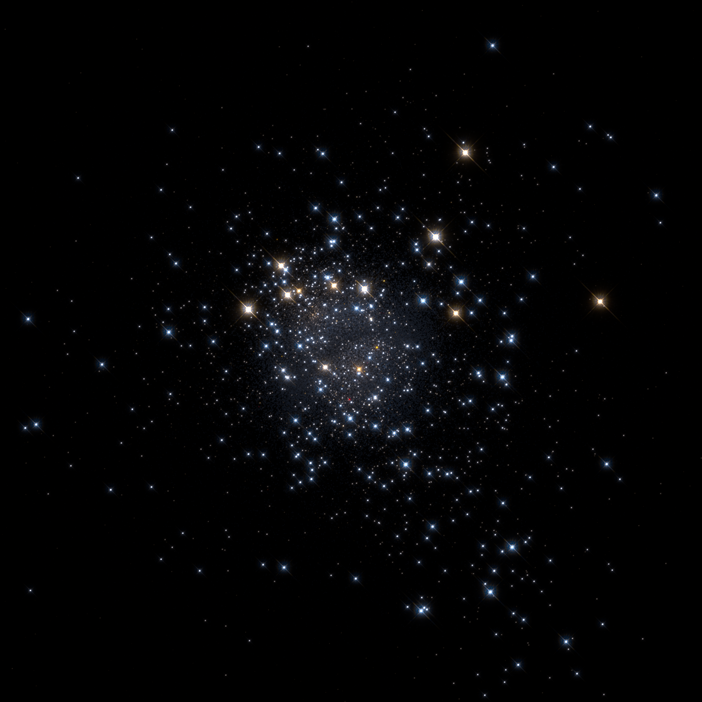

# FRESCO
Fabricate Reality-Emulating Star Cluster Observations

Fresco creates a Hubble WFC3-like image from an AMUSE-type hdf5 file of stars
(other filetypes, like the Starlab format, are also supported). The positions
and masses of the stars are always used, if information on the temperature and
radius is not available this is calculated using the SSE stellar evolution
code.

Gas/dust particles may also be read, and will cause extinction and reflection
of light from background- and nearby stars, respectively.

A random field of back/foreground stars may be added to the image, as a way to
make the image more natural looking or to provide a background that may be
obscured by the gas/dust particles.

## Requirements

- Python 2.7 (3.x experimental)
- Numpy
- Matplotlib
- AMUSE (https://github.com/amusecode/amuse)
  - FIMap
  - SSE (optional)
- Astropy (or Pyfits)

## Authors

Fresco is written by Inti Pelupessy and Steven Rieder
